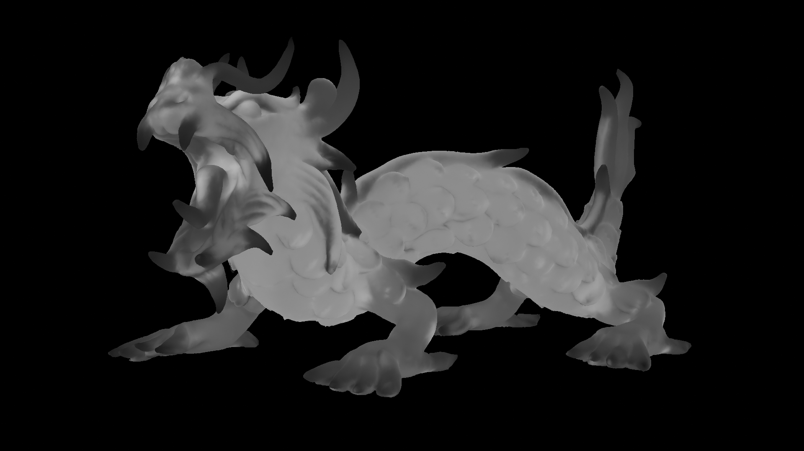
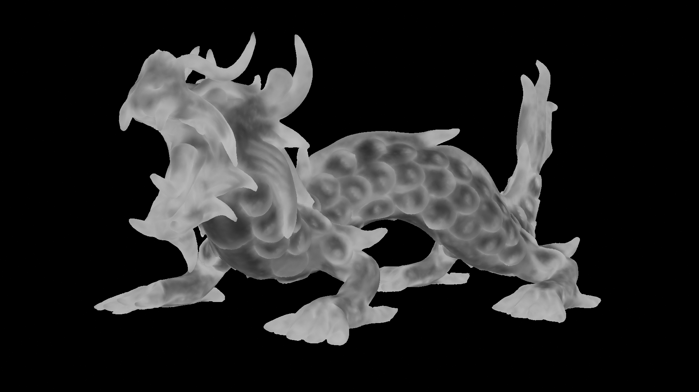

[English](README_EN.md) · **中文**

# Ourobake · 衔尾烘焙

网格的厚度与曲率被烘焙进 fp32 颜色属性，供着色器直接读取。

| 厚度通道 | 曲率通道 |
|---|---|
|  |  |

图片参数：采样次数 256，尺度 3 米，差分步长缩放 0.1，表面偏移 0，采样锥大小 0.25。目标模型为 Stanford 3D Scanning Repository 的 `xyzrgb_dragon`。

## 方案

Blender 的烘焙在一趟之内写出结果，Cycles 的 progressive refine 又与烘焙互斥（[blender#83344](https://projects.blender.org/blender/blender/issues/83344)），因此「多趟采样再求平均」在 Blender 内部没有现成通道。Ourobake 把迭代循环交给插件：`iterative_baker.py` 反复调用 `bpy.ops.object.bake()`，节点组则让着色器读取正在被写入的那个颜色属性。一趟烘焙对应一次不动点迭代的推进，渲染管线承担了求解器单步。

## 原理

$P$、$N$、$T$ 取自几何数据节点，属性当前值为 $C=(R,G,B,A)$。接口参数包括采样次数 $N_s$、尺度 $L$、差分步长缩放 $k$、表面偏移 $o$、采样锥大小 $w$。

单趟开始时先读出迭代计数与权重，其中 $\varepsilon=10^{-6}$ 是节点组内部的常量：

$$n=\frac{B}{\varepsilon},\qquad i=n+1,\qquad f=\frac{1}{n+1},\qquad B'=B+\varepsilon$$

采样方向位于圆锥内，锥角随进度张开，并在曲率高处收窄：

$$s=\frac{i}{N_s},\qquad c=\mathrm{clamp}\left(w\,s\,\mathrm{mix}\left(1,\ \frac{1}{1+LG},\ s^{2}\right),\ 0,\ 1\right)$$

方位角由黄金比序列给出，逐点白噪声提供不同的相位起点：

$$\theta=\pi\cdot 0.61805\cdot\left(i+2\pi\cdot\mathrm{noise}_{3D}(P)\right)$$

$$\hat e=\mathrm{normalize}\left(\hat B\cos\theta+\hat T\sin\theta\right),\qquad \hat B=\mathrm{normalize}(N\times T)$$

$$d=\mathrm{normalize}\left((1-c)(-N)+c\,\hat e\right)$$

$$t=\mathrm{SelfHit}\left(P-oN,\ d,\ L\right)\cdot\left(\mathrm{HitDistance}+o\right)$$

曲率由弧矢构造测得。探针方位角为 $\varphi=\pi\cdot 0.61805\cdot i$，两个探针点位于 $P_\pm=P\pm h\hat e_c$，各自沿 $\pm N$ 发出长度为 $8h$ 的射线，未命中记为 0：

$$h=\mathrm{clamp}\left(R'k,\ 0.01,\ 0.25\right)$$

$$\kappa=\frac{\Sigma d}{h^{2}+\frac{1}{4}(\Sigma d)^{2}},\qquad \Sigma d=d_{1}+d_{2}+d_{3}+d_{4}$$

半径为 $R$ 的球面上，弧矢满足 $s\approx h^{2}/(2R)$，代入后 $\kappa\approx 1/R$，因此 $G$ 通道以 1/米 为单位。该式在 $u=2h$ 处取得极大值 $1/h$，$h\to 0$ 时不会发散。

最后按滑动平均写回属性：

$$R'=(1-f)R+ft,\qquad G'=(1-f)G+f\kappa$$

每趟的输出为三元组 $(R',G',B')$，其中计数器已经加过一次 $\varepsilon$。

## 接口

节点组有 6 个输入与 1 个输出，材质内的链路为「颜色属性」节点、`群组` 节点、`材质输出` 节点。

| 输入 | 默认 | 示例 | 说明 |
|---|---|---|---|
| `颜色属性(FP32)` | — | 接颜色属性节点 | 反馈总线，节点内的 `layer_name` 需与实际属性名一致 |
| `采样次数` | 64 | 256 | 圆锥进度的分母，取值为插件面板 `Iterations` |
| `尺度(米)` | 3.0 | 3.0 | 厚度射线长度，绝对长度 |
| `差分步长缩放` | 0.05 | 0.1 | 曲率步长系数 |
| `表面偏移` | 0.0 | 0.0 | 射线起点沿法线内推的距离 |
| `采样锥大小` | 0.25 | 0.25 | 圆锥张开度的上限 |
| `Vector`（输出） | — | 接 `材质输出` 的 Surface | 结果三元组，接入 Surface 后按自发光处理 |

## 使用

工程文件 `thickness&curvature.blend` 在 Blender 5.2 或更高版本中打开。配套插件 `iterative_baker.py` 放入 `scripts/addons/` 后启用，分类为 Render。

烘焙的启动条件为属性清零，并要求 `Iterations` 与 `采样次数` 取同一数值。目标对象 `xyzrgb_dragon` 需要处于选中状态，当前模式为物体模式。示例工程中这两处次数都已经设为 256。

```python
import bpy
ca = bpy.data.objects["xyzrgb_dragon"].data.color_attributes["厚度"]
ca.data.foreach_set("color", [0.0] * (len(ca.data) * 4))
```

渲染与烘焙设置与工程内保存的值一致：

| 项 | 值 |
|---|---|
| Render Engine | Cycles |
| Device | CPU |
| Samples | 1 |
| Adaptive Sampling / Denoise | 关闭 |
| Seed / Animated Seed | 0 / 关闭 |
| Bake Type | Emit |
| Bake Target | Vertex Colors |
| Selected to Active / Cage | 关闭 |

完成后属性 `厚度` 的内容为：$R$ 为厚度（米），$G$ 为曲率（1/米），$B/10^{-6}$ 为已完成的趟数。

## 示例

龙网格为 124,943 顶点与 249,881 三角面，导入时缩放至 0.01 倍，最大边长 2.02 米。源文件含 123 个不属于任何面的游离顶点，去掉后有效几何正好是源尺寸的百分之一。

256 趟之后的属性统计：

```text
thickness  (m)   mean = 0.172087   min = 0.007495   max = 0.667673
curvature (1/m)  mean = 29.7763    min = 3.37872    max = 92.7339
counter          B    = 2.56001e-4   (256 x 1e-6)
```

单趟耗时约 0.59 秒（i9-11900H，CPU，上述规模的网格），256 趟约 2.5 分钟。均值在前几趟内即趋于稳定，其后各趟主要用于收紧局部估计。

## 注意事项

- 尺度是绝对的。`尺度(米)` 与曲率步长的钳位 0.01、0.25 都以米为单位，模型需要先缩放到米级。以原始 OBJ 的 200 单位尺寸使用时，0.01 的曲率步长约等于模型尺寸的两万分之一。
- Blender 版本下限为 5.2，着色器 Raycast 节点自该版本起提供。在 5.1 及更低版本中打开工程会丢失节点。
- 属性类型为 fp32 的 `FLOAT_COLOR`，需要设为活动颜色属性并与节点的 `layer_name` 同名。8 位顶点色无法存储 $10^{-6}$，计数器会停在 0。
- 曲率无符号，凸脊与凹谷的读数相同。`POINT` 域的分辨率等于顶点密度，与 UV 和贴图无关。
- 厚度统计命中自身的射线，尽管如此场景内其他物体仍可能会构成遮挡。
- 每趟的 Cycles 随机数固定（seed 0、单样本、动画种子关闭），多样性来自迭代序号驱动的方位角序列。
- `采样次数` 需不小于实际总趟数，超出后圆锥表达式饱和、厚度读数失真。计数上限约为 $8\times10^{6}$ 趟，插件的上限为 10000 趟。
- 烘焙直接覆盖属性，没有撤销记录。
- 曲率探针的方位角不含抖动。

## 文件与许可

```text
thickness&curvature.blend   示例工程
iterative_baker.py          配套插件 Iterative Baker
pic/                        渲染图
```

节点组、示例工程与插件采用 MIT 许可，版权归 [grade2](https://github.com/grade2)。

`thickness&curvature.blend` 内嵌的龙网格来自 Stanford 3D Scanning Repository，不属于 MIT 许可范围。该站点的条款要求注明 Stanford Computer Graphics Laboratory，并将用途限于研究与免费再分发，禁止商业使用。移除该网格后，其余部分可按 MIT 自由使用。
